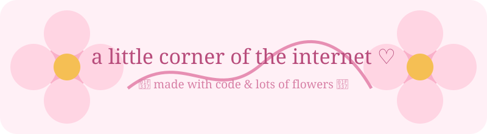

<!-- 🌸 Afaan's little corner 🌸 -->

# 🌷˚₊‧꒰ა ♡ ໒꒱ ‧₊˚🌷
# Hi, I'm Afaan!

### 💻 Computer Science Student · 🌱 Beginner Coder · 🎀 Professional Procrastinator

*welcome to my little corner of github ♡*

🌸 · 🌷 · 🩷 · 🎀 · 🌸 · 🌷 · 🩷

---

## 🌸 a little about me

I'm a **Computer Science student** slowly figuring out this whole coding thing.

I like making little things, learning how they work, breaking them by accident, and then being way too happy when I finally fix them. ♡

- 🌱 Currently learning **Python & programming fundamentals**
- 💻 Exploring **Git, GitHub & software development**
- 🧩 I like figuring out how things work
- 🎮 I play games when I'm not coding
- 🎧 Music + late nights + random ideas = dangerous combination
- 🐣 Still a beginner, but getting better one commit at a time

> 🌷 *"Start small. Keep building. Let future me be impressed."*

---

## 🛠️ my little toolbox

---

## 🌱 currently growing...

| 🌷 | learning |
|:---:|:---|
| 🐍 | Python |
| 🧠 | Programming fundamentals |
| 🌸 | Git & GitHub |
| 💻 | Building small projects |
| 🦋 | Becoming a better developer |

---

## ✨ little goals

- [ ] 🐍 Get really comfortable with Python
- [ ] 🌱 Build some genuinely useful projects
- [ ] 💻 Learn web development
- [ ] 🧠 Get better at problem solving
- [ ] 🌸 Fill this profile with things I've actually made
- [ ] 🎀 Look back one day and see how far I've come

---

## 📌 my projects

I don't have a giant portfolio yet — and honestly, that's okay.

This little section is going to grow as I learn.

### 🌱 coming soon...

**🐣 tiny Python projects**  
little programs made while learning

**🌷 university projects**  
things I build while surviving CS

**🩷 random experiments**  
because sometimes you just have an idea and *have to try it*

---

## 📊 my GitHub journey

---

## 🎀 outside the code

🌸 **games**  
🎧 **music**  
💻 **tech**  
🌙 **late-night ideas**  
🧋 **doing things instead of sleeping**  
🌷 **flowers, obviously**

---

### 🩷 a tiny reminder

> *you don't have to be good at something  
> before you're allowed to enjoy learning it.*

🌷

**learn → mess up → fix it → learn again**

🌸 · 🌷 · 🩷 · 🎀 · 🌸 · 🌷 · 🩷

### thanks for visiting ♡

*have a flower before you leave* 🌷

🌸 🌷 🌸 🌷 🌸

**— Afaan ♡**

